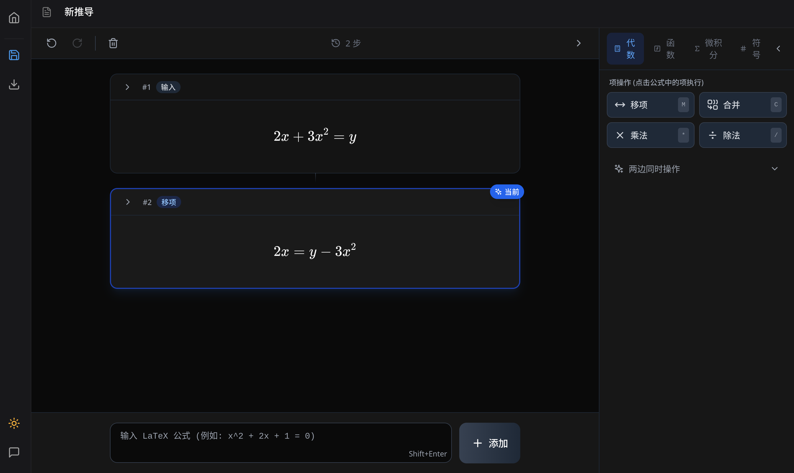

# MathFlow

> 交互式数学表达式推导与学习平台



MathFlow 是一个基于 Web 的交互式数学学习平台，支持符号计算、逐步推导、可视化操作等功能。通过直观的界面，用户可以输入数学表达式，并进行因式分解、展开、化简等操作，同时支持移项、合并同类项等交互式操作。

## 功能特性

### 核心功能

- **交互式推导草稿纸** - 逐步记录数学推导过程，支持撤销/重做
- **符号计算引擎** - 基于 SymPy 的强大数学运算能力
- **智能操作面板** - 支持因式分解、展开、化简、移项、合并同类项等操作
- **LaTeX 公式渲染** - 使用 KaTeX 实现高质量的数学公式显示
- **深色模式** - 护眼的深色主题支持

### 数学操作

- **代数运算**
  - 因式分解 (Factorization) - 本地算法 + SymPy 后端
  - 展开 (Expand) - 多项式展开
  - 化简 (Simplify) - 表达式化简

- **微积分运算**
  - 基础微积分 - 求导、偏导、不定积分、定积分、极限
  - 高级微积分 - Taylor 级数展开、梯度、散度、旋度、拉普拉斯算子
  - 多重积分 - 二重积分、三重积分
  - **双模式操作**：
    - 点击：格式转换（如 `x^2` → `∫ x^2 dx`）
    - Shift+点击：调用后端计算（如 `x^2` → `x^3/3`）
  - 详细实现请参考 [`backend/app/services/sympy_service.py`](code/mathflow-new/backend/app/services/sympy_service.py) 和 [`backend/app/services/vector_calculus.py`](code/mathflow-new/backend/app/services/vector_calculus.py)

- **方程操作**
  - 移项 (Move Term) - 点击项即可移到等号另一侧
  - 合并同类项 (Combine Like Terms)
  - 两边同时运算 (加减乘除)

- **快捷输入**
  - 常用数学符号快捷插入
  - 实时 LaTeX 预览
  - 键盘快捷键支持 (M=移项, C=合并, *=乘法)

### AI 辅助 (可选)

- 当本地算法和 SymPy 后端均无法处理时，可选择启用 AI 辅助功能
- 支持 DeepSeek 等 OpenAI 兼容 API

## 技术栈

### 前端

| 技术 | 版本 | 用途 |
|------|------|------|
| React | 18.3+ | UI 框架 |
| TypeScript | 5.6+ | 类型系统 |
| Vite | 6.0+ | 构建工具 |
| Tailwind CSS | 3.4+ | 样式框架 |
| KaTeX | 0.16.9 | LaTeX 公式渲染 |
| React Router | 6.x | 路由管理 |
| Supabase JS | 2.45+ | 数据库与认证 |

### 后端

| 技术 | 版本 | 用途 |
|------|------|------|
| Python | 3.11+ | 运行时环境 |
| FastAPI | 0.115+ | API 框架 |
| SymPy | 1.13.1 | 符号计算库 |
| Uvicorn | 0.32+ | ASGI 服务器 |

### 容器化

- Podman / Docker
- Podman Compose / Docker Compose

## 项目结构

```
mathflow/
├── code/mathflow-new/          # 前端应用
│   ├── src/
│   │   ├── components/         # React 组件
│   │   │   ├── ScratchPad/    # 草稿纸核心组件
│   │   │   ├── ui/            # 基础 UI 组件
│   │   │   └── feedback/      # 反馈组件
│   │   ├── lib/               # 核心库
│   │   │   ├── factorization.ts   # 数学运算逻辑
│   │   │   ├── equation.ts        # 方程处理工具
│   │   │   └── calculus.ts        # 微积分 API 调用
│   │   ├── pages/             # 页面组件
│   │   ├── providers/         # Context 提供者
│   │   └── theme/             # 主题配置
│   ├── backend/               # SymPy 后端
│   │   ├── app/
│   │   │   ├── main.py        # FastAPI 应用入口
│   │   │   ├── models.py      # Pydantic 模型
│   │   │   └── services/
│   │   │       ├── sympy_service.py     # SymPy 基础服务
│   │   │       └── vector_calculus.py  # 向量微积分模块
│   │   ├── Dockerfile
│   │   └── requirements.txt
│   ├── package.json
│   └── vite.config.ts
├── docker/                     # 容器配置
├── docs/                       # 文档
├── scripts/                    # 脚本工具
├── .env.example                # 环境变量示例
├── Makefile                    # 开发环境管理
├── dev.sh                      # 开发启动脚本
└── README.md
```

## 快速开始

### 前置要求

- Node.js 18+
- pnpm 8+
- Python 3.11+
- Podman 或 Docker

### 1. 克隆项目

```bash
git clone <repository-url>
cd mathflow
```

### 2. 配置环境变量

```bash
cp .env.example .env
# 编辑 .env 文件，配置必要的环境变量
```

### 3. 启动后端 (SymPy API)

使用 Podman Compose:

```bash
cd code/mathflow-new
podman-compose up -d backend
```

或使用 Podman 直接运行:

```bash
cd code/mathflow-new/backend
podman build -t mathflow-sympy:latest .
podman run -d --name mathflow-backend --network host --restart unless-stopped localhost/mathflow-sympy:latest
```

后端将在 `http://localhost:8001` 启动。

### 4. 启动前端

```bash
cd code/mathflow-new
pnpm dev
```

前端将在 `http://localhost:3000` 启动。

## 开发命令

### 前端

```bash
cd code/mathflow-new

# 安装依赖并启动开发服务器
pnpm dev

# 构建生产版本
pnpm build

# 构建优化版本
pnpm build:prod

# 代码检查
pnpm lint

# 预览生产构建
pnpm preview
```

### 后端

```bash
cd code/mathflow-new

# 启动后端容器
podman-compose up -d backend

# 查看后端日志
podman-compose logs -f backend

# 停止后端
podman-compose down
```

### 根级 Makefile

```bash
# 启动完整开发环境 (PostgreSQL, Redis, Nginx 等)
make dev

# 启动生产环境
make prod

# 构建镜像
make build

# 查看日志
make logs

# 清理环境
make clean
```

## API 端点

### SymPy 后端 (端口 8001)

#### 代数运算

| 端点 | 方法 | 描述 |
|------|------|------|
| `/api/factor` | POST | 因式分解表达式 |
| `/api/expand` | POST | 展开表达式 |
| `/api/simplify` | POST | 化简表达式 |

#### 基础微积分

| 端点 | 方法 | 描述 |
|------|------|------|
| `/api/calculus/differentiate` | POST | 求导 |
| `/api/calculus/partial` | POST | 偏导数 |
| `/api/calculus/integrate` | POST | 不定积分 |
| `/api/calculus/definite-integral` | POST | 定积分 |
| `/api/calculus/limit` | POST | 极限 |
| `/api/calculus/limit-infinity` | POST | 无穷极限 |
| `/api/calculus/sum` | POST | 求和 |
| `/api/calculus/product` | POST | 求积 |
| `/api/calculus/taylor` | POST | Taylor 级数展开 |

#### 向量微积分

| 端点 | 方法 | 描述 |
|------|------|------|
| `/api/vector/gradient` | POST | 梯度计算 |
| `/api/vector/divergence` | POST | 散度计算 |
| `/api/vector/curl` | POST | 旋度计算 |
| `/api/vector/laplacian` | POST | 拉普拉斯算子 |

#### 多重积分

| 端点 | 方法 | 描述 |
|------|------|------|
| `/api/integral/double` | POST | 二重积分 |
| `/api/integral/triple` | POST | 三重积分 |

**请求格式（基础）：**

```json
{
  "latex": "x^2",
  "variable": "x"
}
```

**响应格式：**

```json
{
  "result": "\\frac{x^{3}}{3}"
}
```

## 配置说明

### 端口说明

| 服务 | 端口 | 说明 |
|------|------|------|
| 前端 | 3000 | Vite 开发服务器 |
| SymPy API | 8001 | Python 符号计算后端 |
| Supabase/Kong | 8000 | 外部服务占用 |

### 重要环境变量

```bash
# Supabase 配置
VITE_SUPABASE_URL=http://localhost:54321
VITE_SUPABASE_ANON_KEY=your-anon-key

# SymPy 后端
VITE_SYMPY_API_URL=http://localhost:8001

# AI 辅助 (可选)
# 在浏览器 localStorage 中配置:
# ai_api_key: your-api-key
# ai_base_url: https://api.deepseek.com
# ai_model: deepseek-chat
```

## 数学运算流程

1. **输入表达式** - 用户在输入框中输入 LaTeX 公式
2. **选择操作** - 点击操作按钮（因式分解/展开/化简）
3. **本地计算** - 首先尝试本地算法处理
4. **SymPy 后端** - 本地失败则调用 SymPy API
5. **AI 辅助** - 可选启用 AI 作为最后回退方案
6. **记录步骤** - 成功后添加新的推导步骤

## 键盘快捷键

| 快捷键 | 功能 |
|--------|------|
| `Ctrl+Z` | 撤销 |
| `Ctrl+Shift+Z` | 重做 |
| `M` | 移项模式 |
| `C` | 合并同类项模式 |
| `*` | 乘法模式 |
| `Esc` | 取消当前操作 |
| `Shift+Enter` | 添加当前输入 |

### 微积分快捷操作

| 操作 | 功能 |
|------|------|
| 点击微积分按钮 | 格式转换（如 `x^2` → `∫ x^2 dx`） |
| `Shift+点击` 微积分按钮 | 调用后端计算（如 `x^2` → `x^3/3`） |

## 常见问题

### 端口冲突

端口 8000 被 Kong (Supabase) 占用，SymPy 后端使用端口 8001 避免冲突。

### Podman SELinux 问题

在 Fedora 上使用 `--network host` 替代 `-p 8001:8001` 端口映射，避免 SELinux 权限问题。

### 构建失败

清除 Vite 缓存:

```bash
cd code/mathflow-new
rm -rf node_modules/.vite-temp
pnpm build
```

## 贡献

欢迎提交 Issue 和 Pull Request！

### 文档维护

本项目文档应与源代码保持同步。当涉及功能实现和技术细节时，请从源代码中查证：

- **后端实现**: [`code/mathflow-new/backend/app/`](code/mathflow-new/backend/app/)
  - `main.py` - API 端点定义
  - `models.py` - 数据模型
  - `services/sympy_service.py` - SymPy 数学运算
  - `services/vector_calculus.py` - 向量微积分

- **前端实现**: [`code/mathflow-new/src/`](code/mathflow-new/src/)
  - `components/ScratchPad/` - 草稿纸组件
  - `lib/factorization.ts` - 代数运算逻辑
  - `lib/calculus.ts` - 微积分 API 调用

更新文档时请确保：
1. 功能列表与实际实现一致
2. API 端点与 `main.py` 中的定义匹配
3. 技术细节与源代码对应

## 许可证

MIT License
